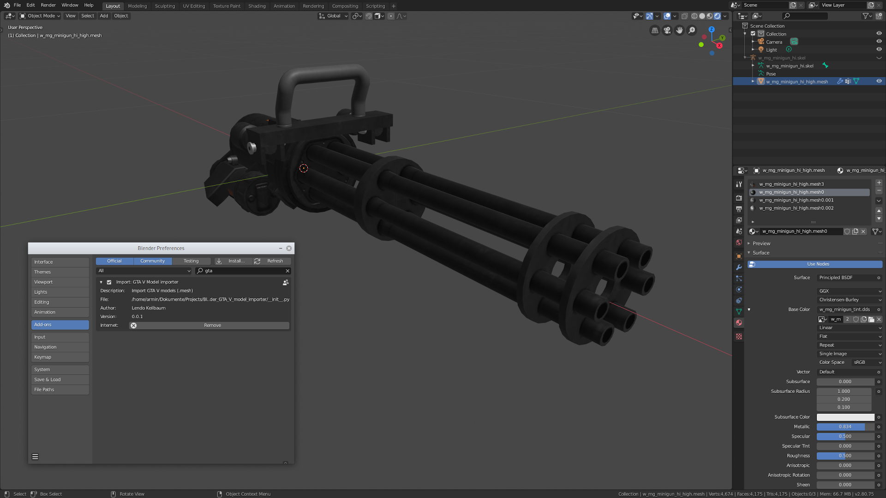

# Blender GTA V model importer
import GTA V models to Blender

## Mesh import:
* UV coordinatis
* bone weights
* custom normals
* armature

## How to use:
* save addon in addon folder and enable it
* go to: File->Import->"GTA V Model (.mesh)"

#### Video:
https://youtu.be/auGvJESp418